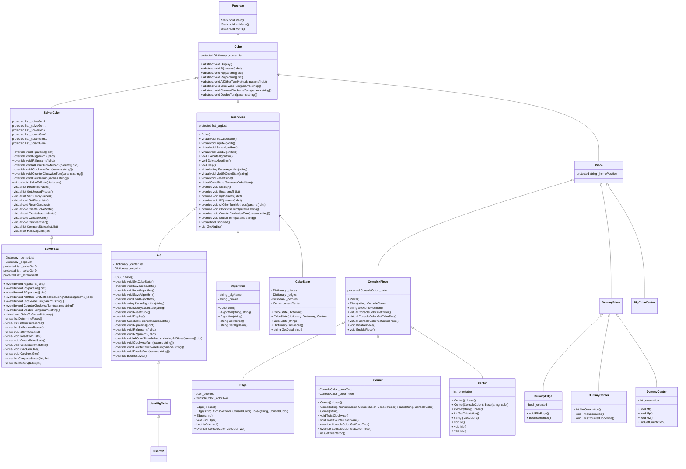

```mermaid
classDiagram
    class Program {
        Static void Main()
        Static void InitMenu()
        Static void Menu()


    <!-- Define all of the constructors for each class -->

    }
    class Cube{
        protected Dictionary<string, Corner> _cornerList
        + abstract void Display()
        + abstract void R(params[] dict<string, Piece>)
        + abstract void Rp(params[] dict<string, Piece>)
        + abstract void R2(params[] dict<string, Piece>)
        + abstract void AllOtherTurnMethods(params[] dict<string, Piece>)
        + abstract void ClockwiseTurn(params string[])
        + abstract void CounterClockwiseTurn(params string[])
        + abstract void DoubleTurn(params string[])
    }
    class SolverCube{
        protected list<dict<string, Piece> _solveGen1
        protected list<dict<string, Piece> _solveGen...
        protected list<dict<string, Piece> _solveGen7
        protected list<dict<string, Piece> _scramGen1
        protected list<dict<string, Piece> _scramGen...
        protected list<dict<string, Piece> _scramGen7
        + override void R(params[] dict<string, Piece>)
        + override void Rp(params[] dict<string, Piece>)
        + override void R2(params[] dict<string, Piece>)
        + override void AllOtherTurnMethods(params[] dict<string, Piece>)
        + override void ClockwiseTurn(params string[])
        + override void CounterClockwiseTurn(params string[])
        + override void DoubleTurn(params string[])
        <!-- Solve to state will call the other methods required for executing the solve -->
        <!-- The tuple contains the piece and the string indicates the tracking level. Full is fully tracked, partial tracks orientation only, ignored will be converted to a dummy piece -->
        + virtual void SolveToState(dictionary<string, (Piece, string)>)
        - virtual list<string> DetermineFaces()
        - virtual list<string> GetUnusedPieces()
        - virtual list<string> SetDummyPieces()
        - virtual void SetPieceLists()
        - virtual void ResetGenLists()
        - virtual void CreateSolveState()
        - virtual void CreateScrambState()
        - virtual void CalcGenOne()
        - virtual void CalcNextGen()
        - virtual list<dict<string, Piece> CompareStates(list<dict<string, Piece>, list<dict<string, Piece>)
        - virtual list<string> MakeAlgLists(list<dict<string, Piece>)
    }
    class Solver3x3{
        - Dictionary<string, Center> _centerList
        - Dictionary<string, Edge> _edgeList
        protected list<dict<string, Piece> _solveGen8
        protected list<dict<string, Piece> _solveGen9
        protected list<dict<string, Piece> _scramGen8
        + override void R(params[] dict<string, Piece>)
        + override void Rp(params[] dict<string, Piece>)
        + override void R2(params[] dict<string, Piece>)
        + override void AllOtherTurnMethodsIncludingAllSlices(params[] dict<string, Piece>)
        + override void ClockwiseTurn(params string[])
        + override void CounterClockwiseTurn(params string[])
        + override void DoubleTurn(params string[])
        <!-- Solve to state will call the other methods required for executing the solve -->
        <!-- The tuple contains the piece and the string indicates the tracking level. Full is fully tracked, partial tracks orientation only, ignored will be converted to a dummy piece -->
        + virtual void SolveToState(dictionary<string, (Piece, string)>)
        - virtual list<string> DetermineFaces()
        - virtual list<string> GetUnusedPieces()
        - virtual list<string> SetDummyPieces()
        - virtual void SetPieceLists()
        - virtual void ResetGenLists()
        - virtual void CreateSolveState()
        - virtual void CreateScrambState()
        - virtual void CalcGenOne()
        - virtual void CalcNextGen()
        - virtual list<dict<string, Piece> CompareStates(list<dict<string, Piece>, list<dict<string, Piece>)
        - virtual list<string> MakeAlgLists(list<dict<string, Piece>)
    }
    class UserCube{
        protected list<Algorithm> _algList
        + Cube()
        + virtual void SetCubeState()
        + virtual void InputAlgorith()
        + virtual void SaveAlgorithm()
        + virtual void LoadAlgorithm()
        + void ExecuteAlgorithm()
        + void DeleteAlgorithm()
        + void Help()
        + virtual string ParseAlgorithm(string)
        + virtual void ModifyCubeState(string)
        + virtual void ResetCube()
        + virtual CubeState GenerateCubeState()
        + override void Display()
        + override void R(params[] dict<string, Piece>)
        + override void Rp(params[] dict<string, Piece>)
        + override void R2(params[] dict<string, Piece>)
        + override void AllOtherTurnMethods(params[] dict<string, Piece>)
        + override void ClockwiseTurn(params string[])
        + override void CounterClockwiseTurn(params string[])
        + override void DoubleTurn(params string[])
        + virtual bool IsSolved()
        + List<Algorithm> GetAlgList()
    }
    class 3x3 {
        - Dictionary<string, Center> _centerList
        - Dictionary<string, Edge> _edgeList
        + 3x3() : base()
        + override void SetCubeState()
        + override void SaveCubeState()
        + override void InputAlgorithm()
        + override void SaveAlgorithm()
        + override void LoadAlgorithms()
        + override string ParseAlgorithm(string)
        + override void ModifyCubeState(string)
        + override void ResetCube()
        + override void Display()
        + override CubeState GenerateCubeState()
        + override void R(params[] dict<string, Piece>)
        + override void Rp(params[] dict<string, Piece>)
        + override void R2(params[] dict<string, Piece>)
        + override void AllOtherTurnMethodsIncludingAllSlices(params[] dict<string, Piece>)
        + override void ClockwiseTurn(params string[])
        + override void CounterClockwiseTurn(params string[])
        + override void DoubleTurn(params string[])
        + override bool IsSolved()
    }
    class UserBigCube{

    }
    class User5x5{

    }
    class Piece{
        protected string _homePosition
    }
    class DummyPiece{

    }
    class DummyEdge{
        - bool _oriented
        + void FlipEdge()
        + bool IsOriented()
    }
    class DummyCenter{
        - int _orientation
        <!-- Orientation 0 : U, 1 : F, 2 : D, 3 : B, 4 : R, 5 : L -->
        + void M()
        + void Mp()
        + void M2()
        + int GetOrientation()
    }
    class DummyCorner{
        + int GetOrientation()
        + void TwistClockwise()
        + void TwistCounterClockwise()
    }
    class ComplexPiece {
        protected ConsoleColor _color
        + Piece()
        + Piece(string, ConsoleColor)
        + string GetHomePosition()
        + virtual ConsoleColor GetColor()
        + virtual ConsoleColor GetColorTwo()
        + virtual ConsoleColor GetColorThree()
        + void DisablePiece()
        + void EnablePiece()
    }
    class Edge{
        - bool _oriented
        - ConsoleColor _colorTwo
        + Edge() : base()
        + Edge(string, ConsoleColor, ConsoleColor) : base(string, ConsoleColor)
        + Edge(string)
        + void FlipEdge()
        + bool IsOriented()
        + override ConsoleColor GetColorTwo()
    }
    class Corner{
        - ConsoleColor _colorTwo;
        - ConsoleColor _colorThree;
        + Corner() : base()
        + Corner(string, ConsoleColor, ConsoleColor, ConsoleColor) : base(string, ConsoleColor)
        + Corner(string)
        + void TwistClockwise()
        + void TwistCounterClockwise()
        + override ConsoleColor GetColorTwo()
        + override ConsoleColor GetColorThree()
        + int GetOrientation()
    }
    class Center{
        - int _orientation
        <!-- Orientation 0 : U, 1 : F, 2 : D, 3 : B, 4 : R, 5 : L -->
        + Center() : base()
        + Center(ConsoleColor) : base(string, color)
        + Center(string) : base()
        + int GetOrientation()
        + string[] GetColors()
        + void M()
        + void Mp()
        + void M2()
    }
    class BigCubeCenter {

    }
    class Algorithm {
        - string _algName
        - string _moves
        + Algorithm()
        + Algorithm(string, string)
        + Algorithm(string)
        + string GetMoves()
        + string GetAlgName()
    }
    class CubeState {
        - Dictionary<string, Piece> _pieces
        - Dictionary<string, Edge> _edges
        -Dictionary<string, Corner> _corners
        - Center currentCenter
        + CubeState(Dictionary<string, Corner>)
        + CubeState(dictionary<string, Corner>, Dictionary<string, Edge>, Center)
        + CubeState(string)
        + Dictionary<string, Piece> GetPieces()
        + string GetDataString()
    }
    Program <-- Cube
    Cube <|-- SolverCube 
    SolverCube <|-- Solver3x3
    Cube <|-- UserCube
    3x3 <|-- UserBigCube
    UserBigCube <|-- User5x5
    UserCube <|-- 3x3
    Cube <-- Piece
    Piece <|-- ComplexPiece
    Piece <|-- DummyPiece
    ComplexPiece <|-- Edge 
    ComplexPiece <|-- Corner 
    ComplexPiece <|-- Center
    Piece <|-- BigCubeCenter
    DummyPiece <|-- DummyEdge
    DummyPiece <|-- DummyCorner
    DummyPiece <|-- DummyCenter
    UserCube<-- Algorithm
    UserCube<-- CubeState


```