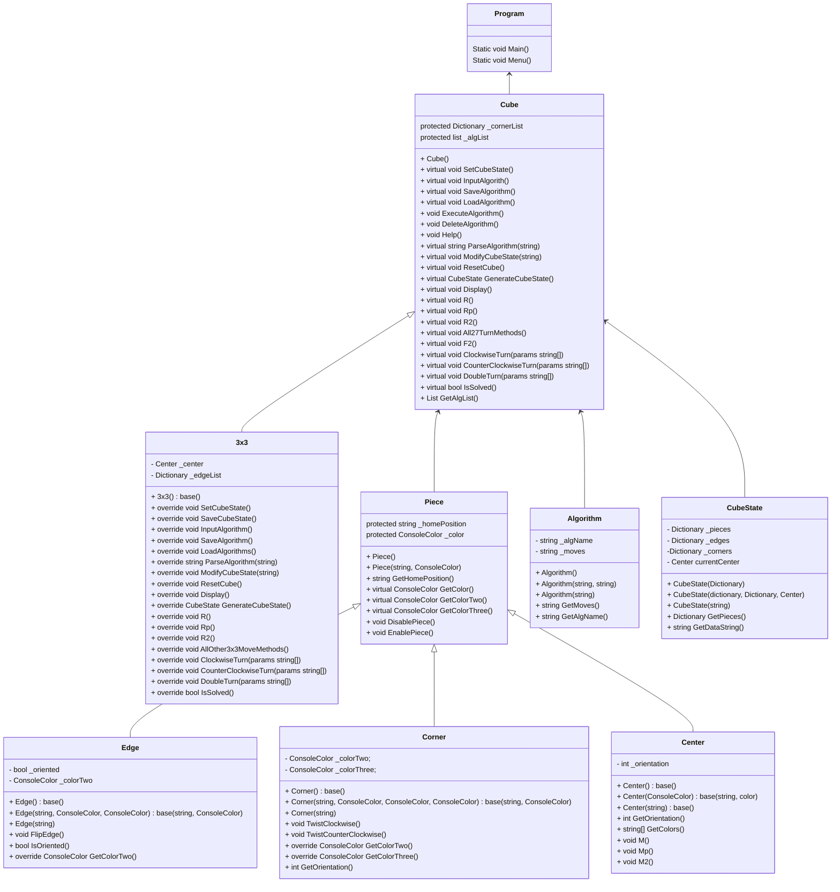

```mermaid
classDiagram
    class Program {
        Static void Main()
        Static void Menu()

    }
    class Cube {
        protected Dictionary<string, Corner> _cornerList
        protected list<Algorithm> _algList
        + Cube()
        + virtual void SetCubeState()
        + virtual void InputAlgorith()
        + virtual void SaveAlgorithm()
        + virtual void LoadAlgorithm()
        + void ExecuteAlgorithm()
        + void DeleteAlgorithm()
        + void Help()
        + virtual string ParseAlgorithm(string)
        + virtual void ModifyCubeState(string)
        + virtual void ResetCube()
        + virtual CubeState GenerateCubeState()
        + virtual void Display()
        + virtual void R()
        + virtual void Rp()
        + virtual void R2()
        + virtual void All27TurnMethods()
        + virtual void F2()
        + virtual void ClockwiseTurn(params string[])
        + virtual void CounterClockwiseTurn(params string[])
        + virtual void DoubleTurn(params string[])
        + virtual bool IsSolved()
        + List<Algorithm> GetAlgList()

    }
    class 3x3 {
        - Center _center
        - Dictionary<string, Edge> _edgeList
        + 3x3() : base()
        + override void SetCubeState()
        + override void SaveCubeState()
        + override void InputAlgorithm()
        + override void SaveAlgorithm()
        + override void LoadAlgorithms()
        + override string ParseAlgorithm(string)
        + override void ModifyCubeState(string)
        + override void ResetCube()
        + override void Display()
        + override CubeState GenerateCubeState()
        + override void R()
        + override void Rp()
        + override void R2()
        + override void AllOther3x3MoveMethods()
        + override void ClockwiseTurn(params string[])
        + override void CounterClockwiseTurn(params string[])
        + override void DoubleTurn(params string[])
        + override bool IsSolved()
    }
    class Piece {
        protected string _homePosition
        protected ConsoleColor _color
        + Piece()
        + Piece(string, ConsoleColor)
        + string GetHomePosition()
        + virtual ConsoleColor GetColor()
        + virtual ConsoleColor GetColorTwo()
        + virtual ConsoleColor GetColorThree()
        + void DisablePiece()
        + void EnablePiece()
    }
    class Edge{
        - bool _oriented
        - ConsoleColor _colorTwo
        + Edge() : base()
        + Edge(string, ConsoleColor, ConsoleColor) : base(string, ConsoleColor)
        + Edge(string)
        + void FlipEdge()
        + bool IsOriented()
        + override ConsoleColor GetColorTwo()
    }
    class Corner{
        - ConsoleColor _colorTwo;
        - ConsoleColor _colorThree;
        + Corner() : base()
        + Corner(string, ConsoleColor, ConsoleColor, ConsoleColor) : base(string, ConsoleColor)
        + Corner(string)
        + void TwistClockwise()
        + void TwistCounterClockwise()
        + override ConsoleColor GetColorTwo()
        + override ConsoleColor GetColorThree()
        + int GetOrientation()
    }
    class Center{
        - int _orientation
        + Center() : base()
        + Center(ConsoleColor) : base(string, color)
        + Center(string) : base()
        + int GetOrientation()
        + string[] GetColors()
        + void M()
        + void Mp()
        + void M2()
    }
    class Algorithm {
        - string _algName
        - string _moves
        + Algorithm()
        + Algorithm(string, string)
        + Algorithm(string)
        + string GetMoves()
        + string GetAlgName()
    }
    class CubeState {
        - Dictionary<string, Piece> _pieces
        - Dictionary<string, Edge> _edges
        -Dictionary<string, Corner> _corners
        - Center currentCenter
        + CubeState(Dictionary<string, Corner>)
        + CubeState(dictionary<string, Corner>, Dictionary<string, Edge>, Center)
        + CubeState(string)
        + Dictionary<string, Piece> GetPieces()
        + string GetDataString()
    }
    Cube <|-- 3x3
    Program <-- Cube
    Cube <-- Piece
    Piece <|-- Edge 
    Piece <|-- Corner 
    Piece <|-- Center
    Cube<-- Algorithm
    Cube<-- CubeState


```